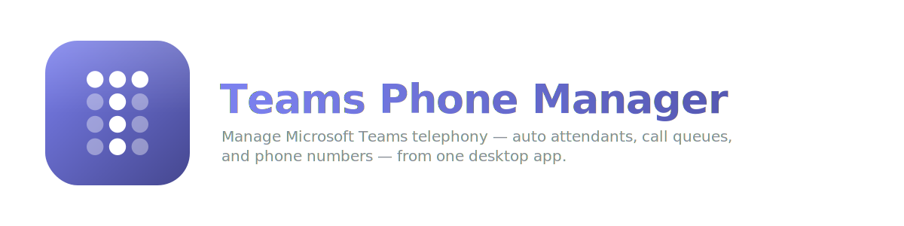

<p align="center">
  
</p>

<p align="center">
  <a href="https://github.com/realgarit/teams-phonemanager/releases/latest"></a>
  <a href="https://github.com/realgarit/teams-phonemanager/actions/workflows/build.yml"></a>
  <a href="LICENSE"></a>
  
  
</p>

<p align="center">
  <b>Manage Microsoft Teams telephony — auto attendants, call queues, and phone numbers — from one desktop app.</b>
</p>

<p align="center">
  <a href="#installation">Install</a> ·
  <a href="#features">Features</a> ·
  <a href="#screenshots">Screenshots</a> ·
  <a href="#architecture">Architecture</a> ·
  <a href="#contributing">Contributing</a>
</p>

---

Teams Phone Manager is an Avalonia-based desktop app, built on .NET 10, that streamlines
Microsoft Teams Phone System administration — no PowerShell scripting required. It runs
natively on Windows, macOS, and Linux.

## Features

- **Auto Attendants** — create, configure, and manage call routing menus
- **Call Queues** — set up and maintain queue distribution and agent lists
- **Holidays** — manage holiday schedules with built-in regional computus support
- **365 Groups** — integrate resource accounts with Microsoft 365 Groups
- **Resource Accounts** — provision and assign telephony resource accounts
- **Modern UI** — a fast, native, dark/light-themed interface

## Installation

Builds are self-contained — no .NET runtime install required. The Microsoft Teams &
Graph PowerShell modules and PowerShell 7 are included with the app.

### macOS (Homebrew — recommended)

```bash
brew tap realgarit/tap
brew trust realgarit/tap
brew install --cask teams-phonemanager
```

(`brew trust` is only needed once — newer Homebrew requires trusting third-party taps.)

Update later with `brew upgrade --cask teams-phonemanager`.

Manual alternative: download `teams-phonemanager-osx-arm64.zip` (Apple Silicon) or
`teams-phonemanager-osx-x64.zip` (Intel) from the
[latest release](https://github.com/realgarit/teams-phonemanager/releases/latest),
unzip, and drag **Teams Phone Manager.app** to Applications. The app is not notarized,
so for a manual download you must clear the quarantine flag once:
`xattr -dr com.apple.quarantine "/Applications/Teams Phone Manager.app"`.

### Windows (installer — recommended)

Download `teams-phonemanager-win-x64-setup.exe` from the
[latest release](https://github.com/realgarit/teams-phonemanager/releases/latest) and run it.
It installs per-user (no admin rights needed) with a Start-menu shortcut and uninstaller.
The installer is not code-signed yet, so SmartScreen may warn — choose
**More info → Run anyway**. Running a newer installer upgrades in place.

Portable alternative: download `teams-phonemanager-win-x64.zip`, extract, run
`teams-phonemanager.exe`.

### Linux

Download `teams-phonemanager-linux-x64.zip`, extract, then:

```bash
chmod +x teams-phonemanager
./teams-phonemanager
```

### Staying up to date

The app checks GitHub Releases on startup and shows a banner when a newer version is
available (silent when offline).

## Prerequisites

- Windows 10/11, Windows Server 2019+, macOS 12+, or Linux (Ubuntu 20.04+)
- Microsoft Teams & Graph PowerShell Module (included with the app)
- PowerShell 7.4+ (included with the app)

## Screenshots

<details open>
<summary><b>Core workflows</b></summary>
<br/>

| | |
|---|---|
| **Welcome** <br/>  | **Get Started** <br/>  |
| **Variables** <br/>  | **M365 Groups** <br/>  |
| **Call Queues** <br/>  | **Auto Attendants** <br/>  |

</details>

<details>
<summary><b>More: holidays, setup wizard, bulk ops, documentation, light theme</b></summary>
<br/>

| | |
|---|---|
| **Holidays** <br/>  | **Setup Wizard** <br/>  |
| **Bulk Operations** <br/>  | **Documentation** <br/>  |
| **Light Theme** <br/>  | |

</details>

## Architecture

The solution follows **Clean Architecture** (Robert C. Martin): four layers as separate
assemblies with dependencies pointing strictly inward. The Dependency Rule is enforced at
build time by `DependencyRuleTests` (the build fails if a forbidden dependency leaks inward).

- **Domain** — framework-free business rules and value objects (validation rules, the Swiss
  holiday computus, naming/UPN contracts, constants). Zero framework dependencies.
- **Application** — use-case orchestration and the ports (interfaces) the outer layers implement.
- **Infrastructure** — adapters to the outside world; the only layer that references
  `System.Management.Automation` and `Microsoft.Identity.Client`. Holds the PowerShell script
  builders and the MSAL/Graph authentication flow.
- **Presentation** — the Avalonia/MVVM UI (FluentAvalonia, custom dark/light theme); depends only
  on Domain + Application. VM-first view resolution via a `ViewLocator` (no service locator).
- The **executable** (`teams-phonemanager`) is the composition root: it wires implementations to
  ports via dependency injection and references all four layers.

Tech: .NET 10, Avalonia, CommunityToolkit.Mvvm, Microsoft.PowerShell.SDK, MSAL.

## Project Structure

```
teams-phonemanager/
├── Program.cs                         # Composition root (DI wiring, app entry point)
├── teams-phonemanager.csproj          # Executable (references all four layers)
├── TeamsPhoneManager.slnx             # Solution
├── Directory.Build.props              # Shared compiler/analyzer settings
├── src/
│   ├── TeamsPhoneManager.Domain/         # Entities, rules, value objects (no frameworks)
│   ├── TeamsPhoneManager.Application/     # Use cases + ports (interfaces)
│   ├── TeamsPhoneManager.Infrastructure/  # PowerShell/Graph adapters (frozen script builders)
│   └── TeamsPhoneManager.Presentation/    # Avalonia Views, ViewModels, Converters, Resources
├── teams-phonemanager.Tests/          # xUnit tests incl. Dependency-Rule guards
└── Scripts/                           # Publish & download PowerShell modules
```

## Development Setup

1. Install .NET 10 SDK:
   ```bash
   # Download from: https://dotnet.microsoft.com/download/dotnet/10.0
   ```

2. Restore dependencies:
   ```bash
   dotnet restore
   ```

3. Build the application:
   ```bash
   dotnet build
   ```

4. Run the application:
   ```bash
   dotnet run
   ```

## Contributing

1. Fork the repository
2. Create a feature branch
3. Make your changes
4. Test thoroughly
5. Submit a [pull request](https://github.com/realgarit/teams-phonemanager/pulls)

Found a bug or have a feature request? Open an
[issue](https://github.com/realgarit/teams-phonemanager/issues).

## License

This project is licensed under the MIT License — see the [LICENSE](LICENSE) file for details.
