# Teams Phone Manager

An Avalonia-based Microsoft Teams Phone Manager application built with .NET 10 to simplify Microsoft Teams Phone System administration tasks. Cross-platform support for Windows, macOS and Linux.

## Features

- Auto Attendants Management
- Call Queues Management
- Holiday Management
- 365 Groups Integration
- Resource Accounts
- Modern UI

## Prerequisites

- Windows 10/11, Windows Server 2019+, macOS 10.15+, or Linux (Ubuntu 20.04+)
- .NET 10 Runtime (Desktop) - [Download here](https://dotnet.microsoft.com/download/dotnet/10.0)
- Microsoft Teams & Graph PowerShell Module (included with the app)
- PowerShell 7.4+ (included with the app)

## Development Setup

1. Install .NET 10 SDK:
   ```bash
   # Download from: https://dotnet.microsoft.com/download/dotnet/10.0
   ```

2. Restore dependencies:
   ```bash
   dotnet restore
   ```

3. Build the application:
   ```bash
   dotnet build
   ```

4. Run the application:
   ```bash
   dotnet run
   ```

## Usage

1. Download from the latest release
2. Run the application:
   - Windows: `teams-phonemanager.exe`
   - macOS: `teams-phonemanager` (or the .app bundle)
   - Linux: `./teams-phonemanager`

## Architecture

The solution follows **Clean Architecture** (Robert C. Martin): four layers as separate
assemblies with dependencies pointing strictly inward. The Dependency Rule is enforced at
build time by `DependencyRuleTests` (the build fails if a forbidden dependency leaks inward).

- **Domain** — framework-free business rules and value objects (validation rules, the Swiss
  holiday computus, naming/UPN contracts, constants). Zero framework dependencies.
- **Application** — use-case orchestration and the ports (interfaces) the outer layers implement.
- **Infrastructure** — adapters to the outside world; the only layer that references
  `System.Management.Automation` and `Microsoft.Identity.Client`. Holds the PowerShell script
  builders and the MSAL/Graph authentication flow.
- **Presentation** — the Avalonia/MVVM UI (FluentAvalonia, custom dark/light theme); depends only
  on Domain + Application. VM-first view resolution via a `ViewLocator` (no service locator).
- The **executable** (`teams-phonemanager`) is the composition root: it wires implementations to
  ports via dependency injection and references all four layers.

Tech: .NET 10, Avalonia, CommunityToolkit.Mvvm, Microsoft.PowerShell.SDK, MSAL.

## Project Structure

```
teams-phonemanager/
├── Program.cs                         # Composition root (DI wiring, app entry point)
├── teams-phonemanager.csproj          # Executable (references all four layers)
├── TeamsPhoneManager.slnx             # Solution
├── Directory.Build.props              # Shared compiler/analyzer settings
├── src/
│   ├── TeamsPhoneManager.Domain/         # Entities, rules, value objects (no frameworks)
│   ├── TeamsPhoneManager.Application/     # Use cases + ports (interfaces)
│   ├── TeamsPhoneManager.Infrastructure/  # PowerShell/Graph adapters (frozen script builders)
│   └── TeamsPhoneManager.Presentation/    # Avalonia Views, ViewModels, Converters, Resources
├── teams-phonemanager.Tests/          # xUnit tests incl. Dependency-Rule guards
└── Scripts/                           # Publish & download PowerShell modules
```

## Contributing

1. Fork the repository
2. Create a feature branch
3. Make your changes
4. Test thoroughly
5. Submit a pull request

## License

This project is licensed under the MIT License - see the [LICENSE](LICENSE) file for details.

## Screenshots

### Welcome
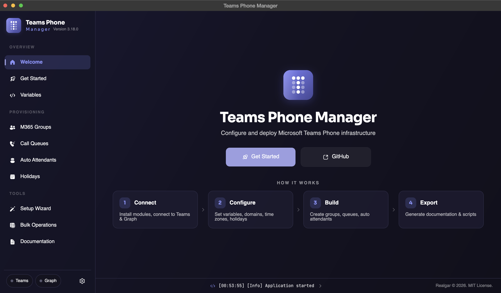

### Get Started
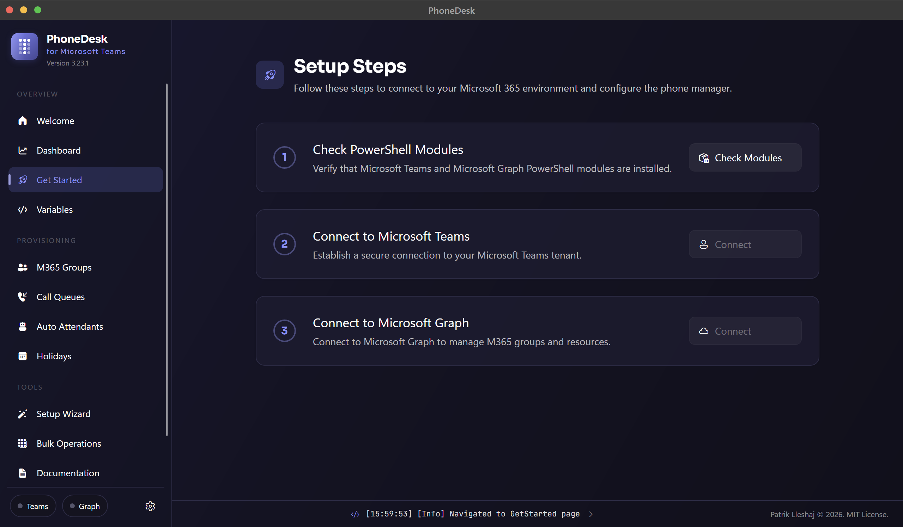

### Variables
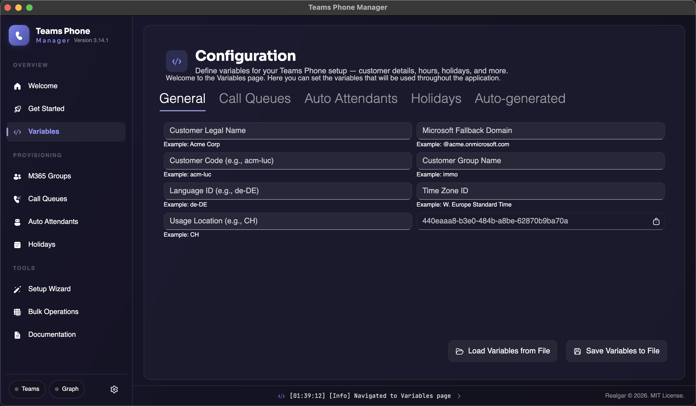

### M365 Groups
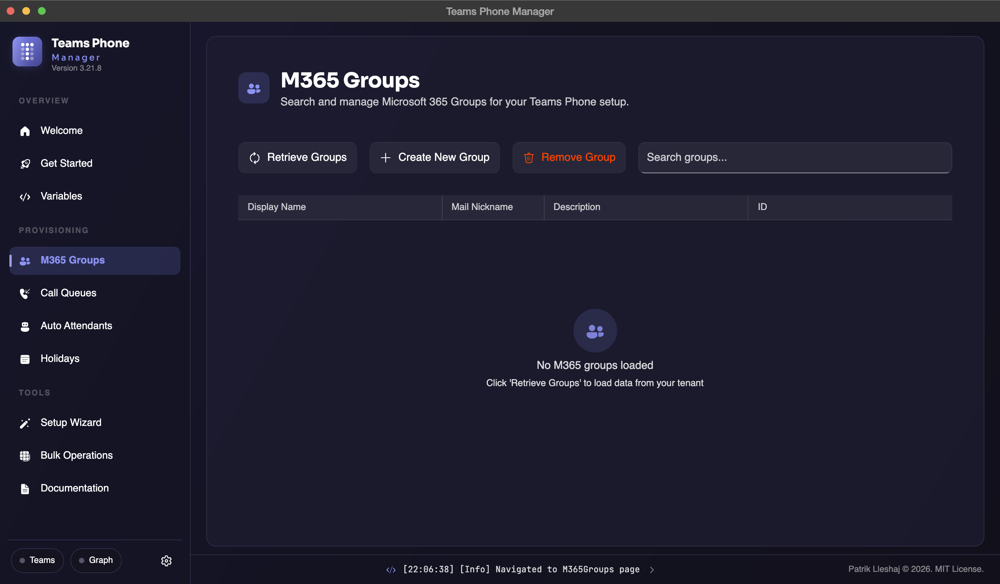

### Call Queues
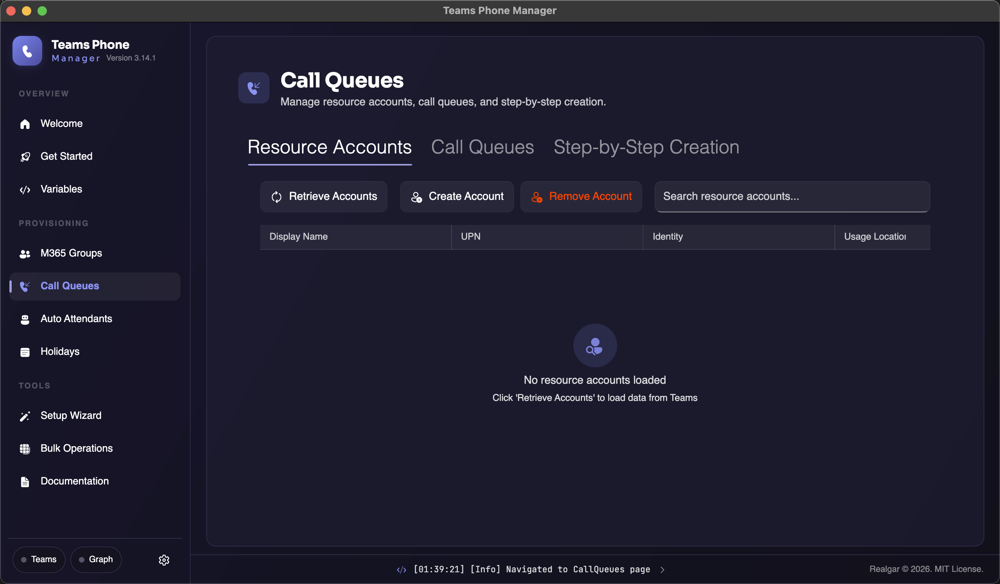

### Auto Attendants
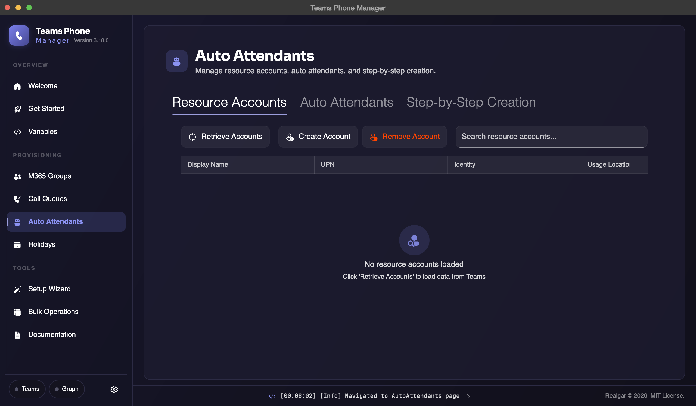

### Holidays
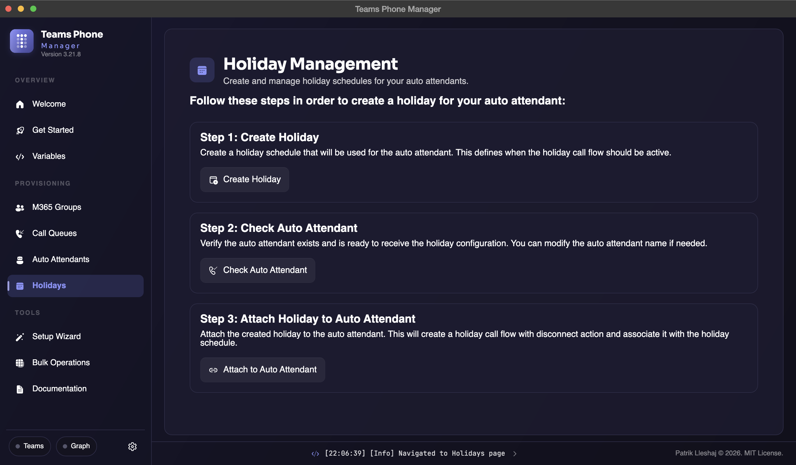

### Setup Wizard
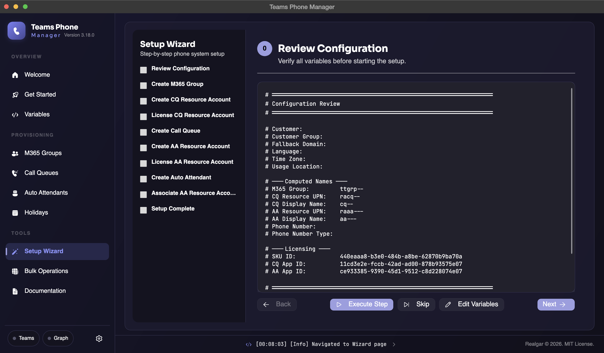

### Bulk Operations
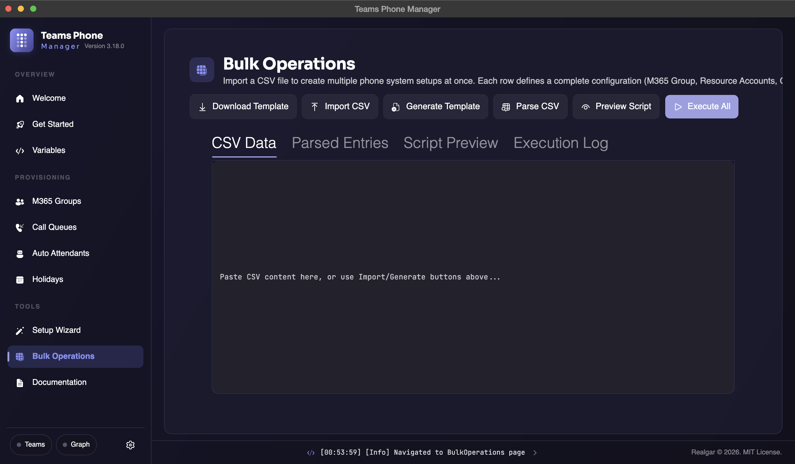

### Documentation
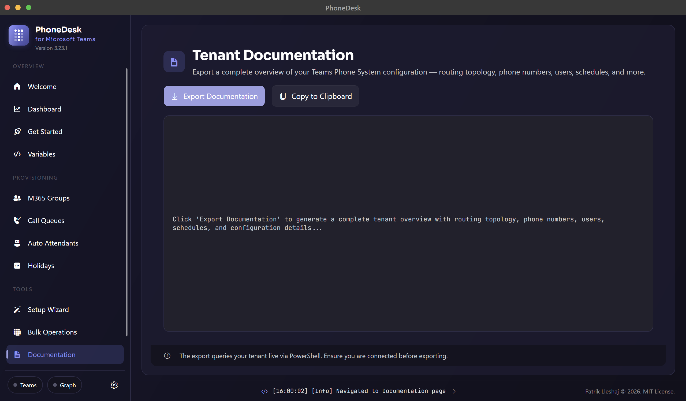

### Light Theme
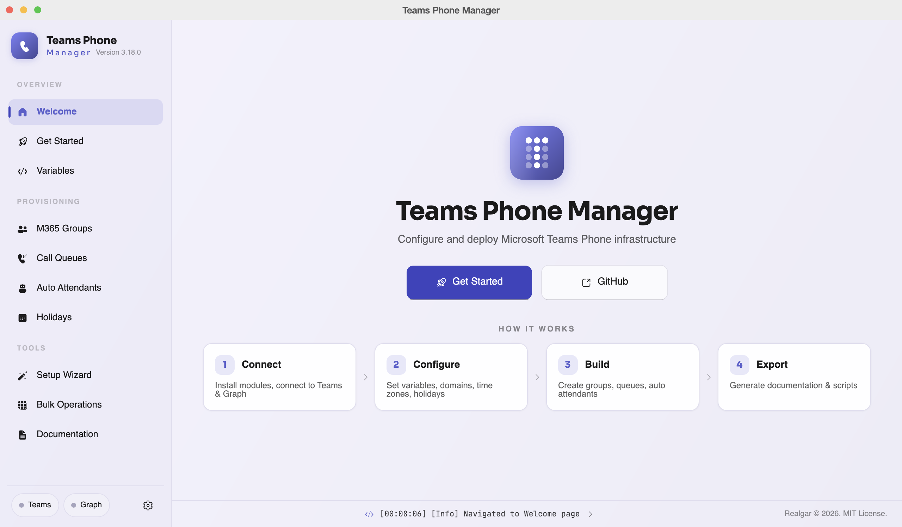
